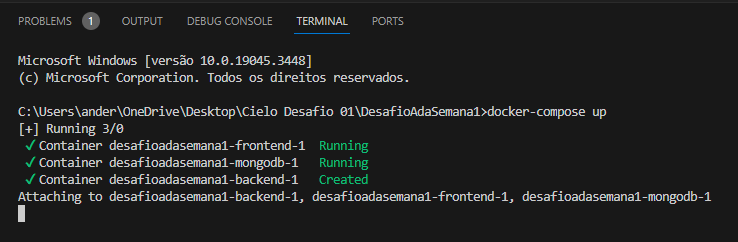

# DOCKER

### Descrição

O Docker é uma tecnologia amplamente adotada na indústria de desenvolvimento de software devido aos inúmeros benefícios que oferece. Aqui estão algumas razões pelas quais consideramos a utilização do Docker em nossa aplicação:

1. **Isolamento de Ambiente:** O Docker permite que se crie contêineres isolados que encapsulam todos os recursos necessários para a execução de nossa aplicação. Isso inclui bibliotecas, dependências e até mesmo o sistema operacional. Isso garante que nossa aplicação funcione consistentemente, independentemente do ambiente em que é executada.

2. **Portabilidade:** Os contêineres Docker são altamente portáteis. Você pode criar um contêiner em seu ambiente de desenvolvimento local e, em seguida, executá-lo em qualquer outro lugar, seja em um servidor de produção, em nuvem ou em outro ambiente de desenvolvimento. Isso elimina problemas de "funciona na minha máquina".

3. **Padronização:** O Docker promove a padronização na construção e implantação de aplicativos. Você pode definir todo o ambiente de execução da aplicação em um arquivo Dockerfile, incluindo as dependências exatas necessárias, o que torna a configuração de novos ambientes muito mais fácil e menos propensa a erros.

4. **Gerenciamento de Versões:** Os contêineres Docker podem incluir uma versão específica de nossa aplicação e todas as suas dependências. Isso facilita a implantação de versões futuras e o controle de quais versões estão em execução em diferentes ambientes.

5. **Escalabilidade:** O Docker facilita a escalabilidade horizontal de aplicativos. Podemos criar e implantar vários contêineres da mesma imagem para distribuir a carga de trabalho e dimensionar nosso aplicativo com facilidade.

6. **Gerenciamento de Dependências:** O Docker simplifica a gestão de dependências. Dessa forma não precisamos nos preocupar com a instalação de bibliotecas ou dependências no sistema host, pois elas são gerenciadas dentro do contêiner.

7. **Facilita a Colaboração:** Ao compartilhar imagens Docker e arquivos Dockerfile, estamos facilitando a colaboração entre desenvolvedores, equipes de operações (DevOps) e outros membros da equipe, garantindo que todos usem o mesmo ambiente de desenvolvimento e implantação.

8. **Segurança:** Os contêineres Docker são altamente isolados, o que ajuda a conter possíveis violações de segurança. Além disso, as imagens Docker podem ser verificadas e assinadas digitalmente para garantir sua integridade.

9. **Recursos Eficientes:** Os contêineres Docker compartilham recursos do sistema operacional subjacente, o que os torna mais eficientes em termos de uso de recursos em comparação com máquinas virtuais tradicionais.

10. **Ecossistema Rico:** O Docker possui um ecossistema vasto e uma ampla variedade de ferramentas e serviços que facilitam tarefas como orquestração de contêineres, escalabilidade automática, monitoramento e gerenciamento de aplicativos em contêiner.

Em resumo, o Docker é uma ferramenta poderosa que utilizamos para simplificar nosso desenvolvimento, implantação e gerenciamento deste aplicativo, tornando todo o processo mais eficiente, consistente e escalável.

----

### Da Instalação e Configuração da Ferramenta

 - O Docker está disponível nativamente para três plataformas, são elas Linux, macOS e Windows. Basta escolher o sistema operacional e seguir as instruções do próprio [Docker](https://docs.docker.com/get-docker/).

 - Para executar nossa aplicação, após a instalação da ferramenta Docker, basta abrir a pasta raiz (aquela em que está o arquivo docker-compose.yml) no terminal, digitar: `docker-compose up`

 
 
 - A aplicação irá subir em 3 containers (backend, frontend e mongo) e estará pronta para utilização, inclusive com variáveis de ambiente já aplicadas.

 - Após subir os containers, para verificar se estão ativos basta digitar o comando `docker ps`